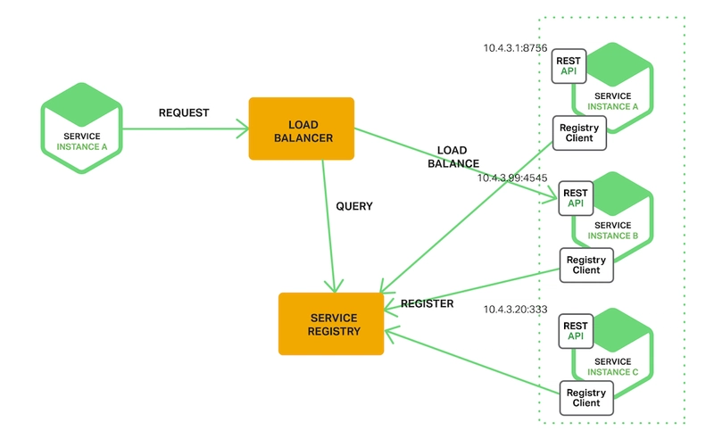
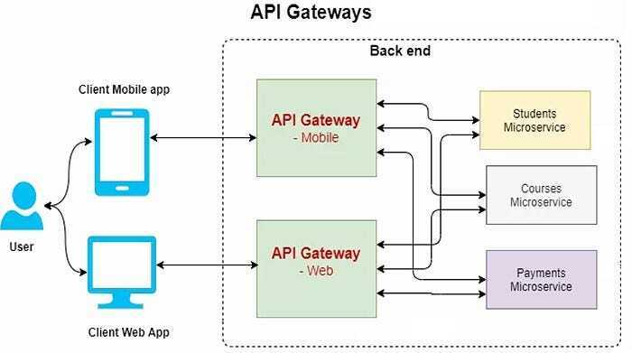
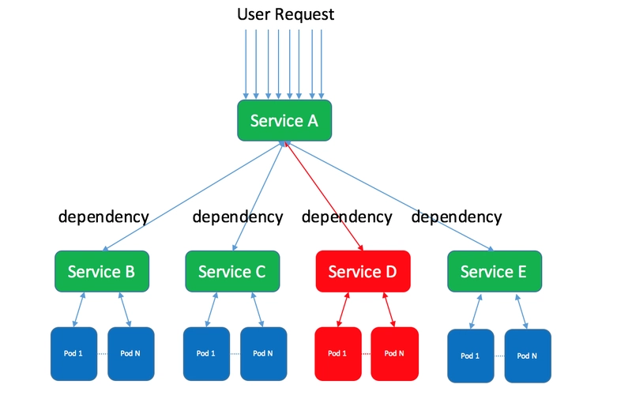
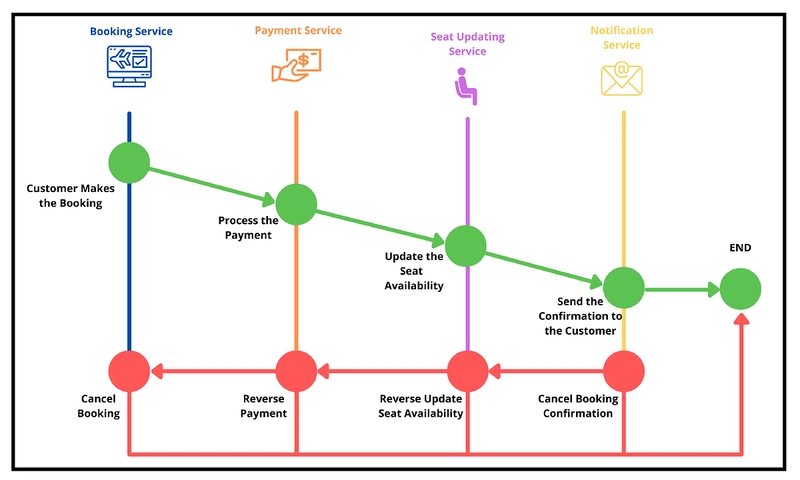
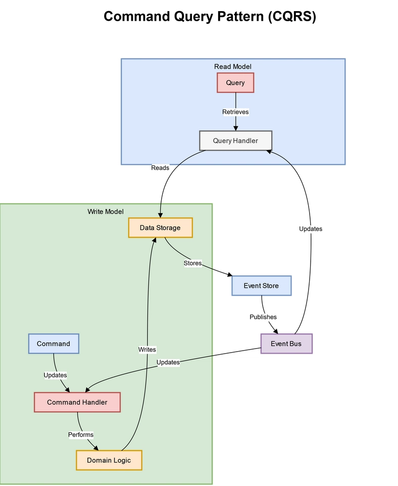
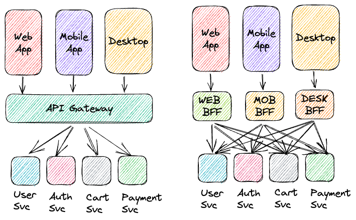

# Microservice Interview Questions

Microservices also known as the microservices architecture is an architectural style where a software application is
structured as a collection of small, independent services that communicate over well-defined APIs. Each service is
focused on a specific business capability and can be developed, deployed, and scaled independently.

## Key Characteristics of Microservices:

- **Independence**: Each microservice can be developed, deployed, and scaled independently.
- **Single Responsibility**: Each service is responsible for a specific business function.
- **Decentralized Data Management**: Each microservice manages its own database or data storage.
- **Communication**: Microservices communicate with each other using lightweight protocols such as HTTP/REST, gRPC, or
  messaging queues.
- **Technology Diversity**: Different microservices can be built using different programming languages and technologies.

## What is Service Registry design pattern?

The Service Registry pattern is a design pattern used in microservices architecture to manage the dynamic discovery of
services. It involves a central registry where services register themselves upon startup and deregister upon shutdown.
Other services can then query the registry to discover the locations of services they need to communicate with.

## What is API Gateway design pattern?

The API Gateway pattern is a design pattern used in microservices architecture to provide a single entry point for all
client requests. The API Gateway handles request routing, composition, and protocol translation, allowing clients to
interact with multiple microservices through a unified interface. It can also handle cross-cutting concerns such as
authentication, logging, rate limiting, and load balancing.

## What is Circuit Breaker design pattern?

The Circuit Breaker pattern is a design pattern used in microservices architecture to improve the resilience and fault
tolerance of a system. It acts as a protective barrier that prevents a service from making requests to a failing
service, thereby avoiding cascading failures and allowing the system to recover gracefully.

## What is Saga design pattern?

The Saga pattern is a design pattern used in microservices architecture to manage distributed transactions across
multiple services. It breaks a transaction into a series of smaller, manageable steps, each handled by a different
microservice. If a step fails, compensating actions are taken to revert the changes made by the previous steps,
ensuring data consistency across the system.

## What is Command Query Responsibility Segregation (CQRS) design pattern?

The Command Query Responsibility Segregation (CQRS) pattern is a design pattern used in microservices architecture to
separate the read and write operations of a system. It involves using different models for reading and writing data,
allowing for optimized performance and scalability for each operation.

## What is Backend for Frontend (BFF) design pattern ?

The Backend for Frontend (BFF) pattern is a design pattern used in microservices architecture to create a dedicated
backend service for each frontend application or user interface. The BFF acts as an intermediary between the frontend
and the underlying microservices, providing a tailored API that meets the specific needs of the frontend.

## What is Circuit Breaker design pattern?

The Circuit Breaker pattern is a design pattern used in microservices architecture to improve the resilience and fault
tolerance of a system. It acts as a protective barrier that prevents a service from making requests to a failing
service, thereby
avoiding cascading failures and allowing the system to recover gracefully.

* Characteristics of Circuit Breaker Pattern:
    - Circuit Breaker enhances fault tolerance by isolating amd managing failures in individual services
    - It continously monitor interactions between services to detect issues in real-time
    - Also useful in temporarily stops requests to failing services
    - It Provides fallback responses or error messages to clients during service failures, ensuring graceful degradation
    - It Automatically transitions back to normal operation when the failing service recovers, improving system
      reliability
    