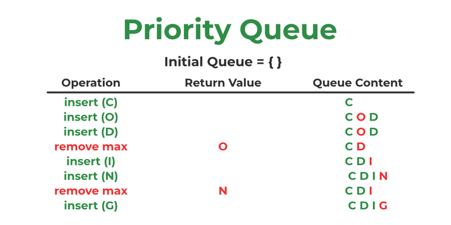

# Java Collections Interview Questions & Answers

## What is the Java Collections Framework?

The Java Collections Framework is a unified architecture for representing and manipulating collections of objects. It
provides a set of interfaces, implementations, and algorithms to handle data structures like lists, sets, maps, and
queues.

## What is the difference between Array & Collection in Java?

- An Array is a fixed-size data structure that can hold elements of the same type, while a Collection is a dynamic data
  structure that can grow or shrink in size and can hold objects of different types.
- Arrays have a fixed length, while Collections can change their size dynamically.
- Arrays can hold primitive data types, while Collections can only hold objects (though autoboxing allows primitives to
  be stored as objects).

## What are the various interfaces used in Java Collection Frameworks ?

The main interfaces in the Java Collections Framework include:

- Collection Interface
- List Interface
- Set Interface
- Map Interface
- Queue Interface
- Deque Interface

## Explain the hierarchy of Java Collections Framework.

The Java Collections Framework is organized into a hierarchy of interfaces and classes

## What is ArrayList in Java?

ArrayList is a resizable array implementation of the List interface in Java. It allows for dynamic resizing and provides
methods to manipulate the list of elements.

## What is the difference between Collection & Collections in Java?

- Collection is an interface in the Java Collections Framework that represents a group of objects, while Collections is
  a utility class that provides static methods for operating on collections.
- Collection is a part of the Java Collections Framework, while Collections is a helper class that provides methods for
  sorting, searching, and manipulating collections.

## What is an iterator ?

An iterator is an object that provides a way to traverse through a collection of elements, one at a time. It allows for
sequential access to the elements without exposing the underlying structure of the collection.

## What is the difference between Iterator & Enumeration in Java?

- Iterator is a newer interface introduced in Java 2, while Enumeration is an older interface that has been part of Java
  since its inception.
- Iterator provides methods for removing elements from the collection during iteration, while Enumeration does not.
- Iterator has a more modern design and is considered more flexible and powerful than Enumeration.
- Iterator works with all types of collections, while Enumeration is primarily used with legacy classes like Vector
  and Hashtable.
- Iterator has methods like `hasNext()`, `next()`, and `remove()`, while Enumeration has methods like
  `hasMoreElements()` and `nextElement()`.
- Iterator is part of the Java Collections Framework, while Enumeration is not.
- Iterator is fail-fast, meaning it throws a `ConcurrentModificationException` if the collection is modified during
  iteration, while Enumeration is not fail-fast.
- Iterator is generally preferred over Enumeration for new code due to its enhanced capabilities and flexibility.
- Iterator can be used with the enhanced for loop (for-each loop) in Java, while Enumeration cannot.
- Iterator is more commonly used in modern Java programming, while Enumeration is considered legacy and is rarely used
  in new code.
- Iterator is part of the `java.util` package, while Enumeration is part of the `java.util` package as well.
- Iterator is more efficient in terms of performance compared to Enumeration, especially for large collections.
- Iterator is more versatile and can be used with various types of collections, while Enumeration is limited to
  specific legacy classes.
- Iterator is more widely supported and recommended in the Java community, while Enumeration is considered outdated.
- Iterator is more consistent with the overall design of the Java Collections Framework, while Enumeration has a more
  inconsistent design.
- Iterator is more user-friendly and easier to work with compared to Enumeration, which can be more cumbersome.
- Iterator is more flexible and can be used in a wider range of scenarios compared to Enumeration, which has
  limited use cases.

## What is the difference between List & Set in Java?

- List is an ordered collection that allows duplicate elements, while Set is an unordered collection that does not
  allow duplicate elements.
- List maintains the insertion order of elements, while Set does not guarantee any specific order.
- List allows access to elements by their index, while Set does not provide index-based access.
- List can contain null elements, while Set can also contain null elements but only one null element.
- List is implemented by classes like ArrayList, LinkedList, and Vector, while Set is implemented by classes like
  HashSet, LinkedHashSet, and TreeSet.
- List is generally used when the order of elements matters and duplicates are allowed, while Set is used when
  uniqueness of elements is required.
- List provides methods like `get()`, `set()`, and `add()` for manipulating elements, while Set provides methods like
  `add()`, `remove()`, and `contains()`.
- List is more flexible in terms of allowing duplicates and maintaining order, while Set is more strict in enforcing
  uniqueness.
- List is more commonly used in scenarios where the order of elements is important, while Set is used in scenarios where
  uniqueness is a priority.
- List can be used for scenarios like maintaining a list of items, while Set can be used for scenarios like storing
  unique values or performing mathematical set operations.
- List is part of the Java Collections Framework, while Set is also part of the Java Collections Framework.
- List is more versatile and can be used in a wider range of scenarios compared to Set, which has specific use cases.
- List is more user-friendly and easier to work with compared to Set, which can be more complex due to its uniqueness
  constraint.
- List is more widely supported and recommended in the Java community, while Set is also widely used but may have
  specific considerations for uniqueness.

## What is the priority queue in Java?

A priority queue is a data structure that stores elements in a way that allows for efficient retrieval of the highest
(or lowest) priority element. In Java, the `PriorityQueue` class implements the `Queue` interface and provides a
way to create a priority queue.

## What are the best practices for using Java Collections?

- Choose the right collection type based on your requirements (e.g., List, Set, Map).
- Use generics to ensure type safety and avoid casting.
- Prefer `ArrayList` over `LinkedList` for most use cases due to better performance.
- Use `HashSet` for fast lookups and `TreeSet` for sorted elements.
- Use `HashMap` for fast key-value pairs and `TreeMap` for sorted keys.
- Avoid using legacy collections like `Vector` and `Hashtable`.
- Use `Collections.unmodifiableList()` or similar methods to create read-only collections when needed.
- Use `Collections.synchronizedList()` or similar methods to create thread-safe collections when needed.
- Avoid modifying a collection while iterating over it to prevent `ConcurrentModificationException`.
- Use `Iterator` or enhanced for loop for iterating over collections.
- Use `Collections.sort()` or `List.sort()` for sorting collections.
- Use `Collections.binarySearch()` for efficient searching in sorted collections.
- Use `Collections.shuffle()` for randomizing the order of elements in a collection.
- Use `Collections.copy()` for copying elements from one collection to another.
- Use `Collections.fill()` for filling a collection with a specific value.
- Use `Collections.reverse()` for reversing the order of elements in a collection.
- Use `Collections.frequency()` for counting the occurrences of an element in a collection.
- Use `Collections.min()` and `Collections.max()` for finding the minimum and maximum elements in a collection.
- Use `Collections.disjoint()` for checking if two collections have no elements in common.
- Use `Collections.addAll()` for adding multiple elements to a collection at once.
- Use `Collections.nCopies()` for creating a collection with a specified number of copies of an element.
- Use `Collections.emptyList()`, `Collections.emptySet()`, and `Collections.emptyMap()` for creating empty collections.
- Use `Collections.singletonList()`, `Collections.singletonSet()`, and `Collections.singletonMap()` for creating
  collections with a single element.
- Use `Collections.newSetFromMap()` for creating a set backed by a map.
- Use `Collections.checkedList()`, `Collections.checkedSet()`, and `Collections.checkedMap()` for creating type-safe
  collections.
- Use `Collections.synchronizedMap()` for creating a thread-safe map.
- Use `Collections.unmodifiableMap()` for creating a read-only map.
- Use `Collections.replaceAll()` for replacing all occurrences of a specific element in a collection.
- Use `Collections.rotate()` for rotating the elements in a list.
- Use `Collections.indexOfSubList()` for finding the index of a sublist within a list.
- Use `Collections.lastIndexOfSubList()` for finding the last index of a sublist within a list.
- Use `Collections.copy()` for copying elements from one list to another.
- Use `Collections.list()` for converting an enumeration to a list.
- Use `Collections.enumeration()` for converting a collection to an enumeration.
- Use `Collections.asLifoQueue()` for creating a LIFO queue from a deque.
- Use `Collections.newSetFromMap()` for creating a set backed by a map.
- Use `Collections.unmodifiableCollection()` for creating a read-only collection.
- Use `Collections.synchronizedCollection()` for creating a thread-safe collection.
- Use `Collections.checkedCollection()` for creating a type-safe collection.
- Use `Collections.addAll()` for adding multiple elements to a collection at once.
- Use `Collections.nCopies()` for creating a collection with a specified number of copies of an element.
- Use `Collections.emptyList()`, `Collections.emptySet()`, and `Collections.emptyMap()` for creating empty collections.
- Use `Collections.singletonList()`, `Collections.singletonSet(), and `Collections.singletonMap()` for creating
  collections with a single element.
- Use `Collections.replaceAll()` for replacing all occurrences of a specific element in a collection.
- Use `Collections.rotate()` for rotating the elements in a list.
- Use `Collections.indexOfSubList()` for finding the index of a sublist within a list.
- Use `Collections.lastIndexOfSubList()` for finding the last index of a sublist within a list.
- Use `Collections.copy()` for copying elements from one list to another.
- Use `Collections.list()` for converting an enumeration to a list.
- Use `Collections.enumeration()` for converting a collection to an enumeration.
- Use `Collections.asLifoQueue()` for creating a LIFO queue from a deque.
- Always check for null values before adding elements to a collection to avoid `NullPointerException`.
- Use `Optional` to handle potential null values in collections.
- Regularly review and optimize your use of collections to ensure efficient memory and performance usage.
- Stay updated with the latest Java versions and features related to collections for improved performance and
  functionality.

## What is the difference between Queue and Stack in Java?

- Queue is a data structure that follows the First-In-First-Out (FIFO) principle, while Stack follows the
  Last-In-First-Out (LIFO) principle.
- In a Queue, elements are added at the rear and removed from the front, while in a Stack, elements are added and
  removed from the top.
- Queue is used for scenarios like task scheduling, while Stack is used for scenarios like function call management.
- Queue is implemented by classes like LinkedList and PriorityQueue, while Stack is implemented by the Stack class.
- Queue provides methods like `offer()`, `poll()`, and `peek()`, while Stack provides methods like `push()`, `pop()`,
  and `peek()`.
- Queue is more suitable for scenarios where order of processing matters, while Stack is more suitable for scenarios
  where the most recent element needs to be accessed first.
- Queue can be used for breadth-first search algorithms, while Stack can be used for depth-first

## What is BlockingQueue in Java?

A BlockingQueue is a type of queue that supports operations that wait for the queue to become non-empty when retrieving
an element, and wait for space to become available in the queue when storing an element. It is part of the
`java.util.concurrent` package and is used in concurrent programming to facilitate communication between threads.

## What is Load Factor in HashMap?

Load Factor in HashMap is a measure that determines when to increase the capacity of the HashMap to maintain efficient
performance. It is defined as the ratio of the number of elements in the HashMap to its current capacity. The default
load factor is 0.75, which provides a good balance between time and space cost. When the load factor exceeds this
threshold, the HashMap is resized to accommodate more elements, which involves rehashing the existing entries to the 
new array.

## What is the diamond operator in Java?
The diamond operator (`<>`) in Java is a shorthand notation introduced in Java 7 that allows for type inference when
instantiating generic classes. It enables the compiler to infer the type parameters based on the context, reducing
redundancy and improving code readability. For example, instead of writing `List<String> list = new ArrayList<String>();`,
you can simply write `List<String> list = new ArrayList<>();`.

